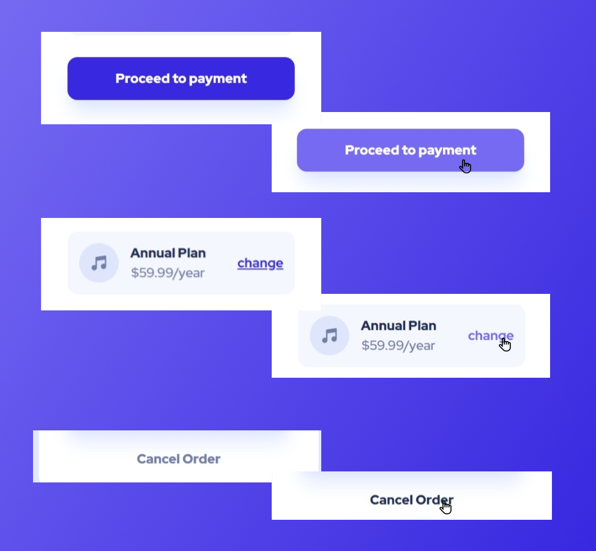

.png)
 ___
It's a solution of a Front-end mentor Challenge [order summary component](https://www.frontendmentor.io/challenges/order-summary-component-QlPmajDUj). It helped me practice the skills I'm learning.

### About the challenge

Users should be able to:

- See hover states for interactive elements

These are some screenshots of the results:

### Links

- [Solution URL](https://github.com/HadjerL/front-end-metor-order-summary.git)
- [Live Site URL](https://stellular-frangollo-13cd9e.netlify.app/)

### Built with

- Semantic HTML5 markup
- CSS custom properties
- Flexbox
- CSS Grid
- [Tailwind CSS](https://tailwindcss.com/) - CSS framework

### what I learned
- Mostly I'm learning how to write good readme file for my projects and I'm practising it here.
- I learned how to add a box shadow in css.
- practiced what I knew already.
### Useful resources
- [Tailwind css official documentation](https://tailwindcss.com/docs/installation) are the best, They help a lot.
### Author
- Frontend Mentor - [@HadjerL](https://www.frontendmentor.io/profile/HadjerL)
